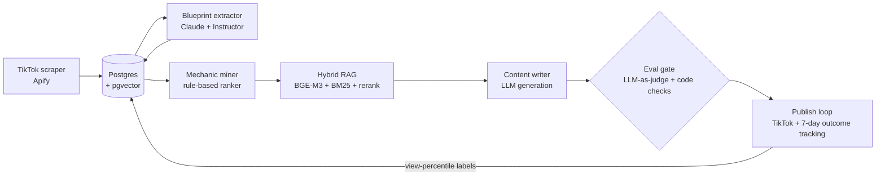

# AI Content Generation Pipeline

An end-to-end system that scrapes trending TikTok content, extracts the structural
"viral mechanics" of each video into a versioned schema using LLM structured output,
retrieves winning patterns with hybrid RAG, and generates new short-form content
packages — with every LLM component gated by an evaluation harness.

Built as a learning-first AI Engineering project: the goal is production-grade
practice across the full applied-AI stack (structured extraction, evals,
retrieval, observability, classical ML, agents), not a quick demo.

## Architecture



- **Scrape** — trending videos per niche via Apify (`apidojo/tiktok-scraper`), with
  WebVTT subtitle enrichment and dedup. A separate archive run collected ~72K videos
  across 14 niches (metadata + video + subtitles) as training data for a downstream
  virality predictor. Scraped data is **not** committed to this repo.
- **Extract** — each video gets a niche-agnostic **Blueprint**: a structured schema of
  its viral mechanics (hook type, narrative devices, pacing, aesthetic descriptors),
  extracted by Claude via [Instructor](https://github.com/jxnl/instructor) with
  Pydantic validation. Schemas are versioned in Postgres
  (`(content_item_id, extractor_version)` unique constraint) so schema evolution
  never silently corrupts old rows.
- **Retrieve** — hybrid retrieval over top-performing Blueprints: BGE-M3 dense
  embeddings in pgvector (HNSW) + BM25, fused and reranked with a cross-encoder.
- **Generate** — a content writer turns a target Blueprint + retrieved winners into a
  full content package (keyframe shot list, script, captions, hashtags) for a
  still-image-to-video pipeline.
- **Evaluate** — nothing ships on vibes. Deterministic code checks plus an anchored
  LLM-as-judge (Opus, 1–5 rubric) run via an eval harness with golden datasets.
  CI gate: extractor `schema_valid_rate ≥ 0.95`. Extraction quality is also
  monitored with temperature self-consistency checks and per-version cost reports.
- **Observe** — Langfuse tracing on LLM calls; per-extractor-version token spend
  tracking.

## Engineering decisions

Significant decisions are recorded as ADRs in [`docs/adr/`](docs/adr/) — including
the Postgres-only commitment (no SQLite fallback), Blueprint schema versioning
policy, and extractor cache policy. The short version of the philosophy:

- **Evals before features.** Every LLM component gets a measurable quality gate
  before it gets a second feature.
- **Schemas are contracts.** LLM output is never trusted raw — Pydantic-validated
  structured output everywhere, versioned when it changes.
- **Providers are pluggable.** All external services (LLM, video gen, TTS, image)
  sit behind abstract base classes, configured in YAML — swapping providers is a
  config edit, not a refactor.

## Status

| Phase | Scope | State |
| ----- | ----- | ----- |
| P1 | Eval harness, golden labels, LLM-as-judge | ✅ Shipped |
| P1.5 | Blueprint extraction (structured LLM output) | ✅ Shipped |
| P2 | Hybrid RAG + reranking | ✅ Shipped |
| P3 | Content writer + writer evals | 🚧 In progress |
| P3.5 | Publish loop (post → track outcomes → write back labels) | Planned |
| P4 | Virality predictor | Planned |
| P5 | Agent orchestration (LangGraph) | Planned |
| P7 | AWS deployment (ECS Fargate, RDS) | Planned |

## Stack

Python 3.13 · FastAPI · Postgres + pgvector (SQLAlchemy 2.0, Alembic) ·
Anthropic + OpenAI SDKs · Instructor · sentence-transformers (BGE-M3) ·
rank-bm25 · Langfuse · RQ · Docker · uv

## Running locally

Requires Docker (Postgres) and a `config/.env` based on `config/.env.example`.

```bash
uv sync --all-groups
uv run alembic upgrade head
uv run python scripts/seed_niches.py
uv run uvicorn src.api.app:app --reload
```

Eval gate and tests:

```bash
uv run python -m src.evals.harness --component blueprint-extractor-v1
uv run pytest
```

## Development notes

Developed with AI pair-programming under an explicit teaching contract
(see [`CLAUDE.md`](CLAUDE.md)): business logic, tests, and design decisions are
human-written; AI assistance is scoped to migrations, configs, and boilerplate,
plus concept-first explanation before each new component.
