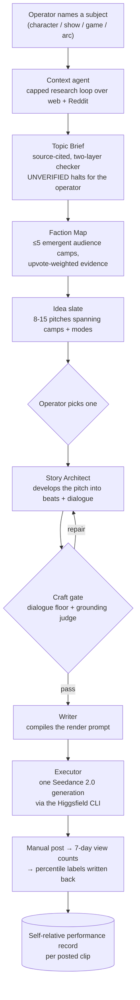

# AI Content Generation Pipeline

An end-to-end pipeline that turns a single subject name — a character, a show, a game, an
arc — into a finished short-form video package: researched premise, audience map, story
script, render prompt, and a generated clip.

Built as an AI-engineering portfolio project. The interesting parts are not the video
output; they are the parts that make an unattended LLM pipeline behave: schema-locked
artifact contracts between stages, LLM-as-judge gates that can send work backward for
repair, swappable model "seats" defined in YAML, cost governance before every paid call,
and an eval harness with golden fixtures.

> **Status: in development.** The POV first-person lane has run live end-to-end —
> clips generated, posted, and measured through the publish loop. The Exilus research
> front-end is built and fakes-verified but has not yet run live. See
> [Component status](#component-status) — every claim below is labelled.

---

## What it does



The product constraint that shapes everything downstream: the video is **pure picture and
native sound**. No voiceover, no hook card, no on-screen text of any kind, and one
continuous moment per clip — no time-skips. That rules out the usual crutches, so the
whole burden falls on the premise and the prompt.

## Why it is built this way

A generation pipeline is easy to demo and hard to keep honest. Six things do the work:

**Artifact contracts between stages.** Every stage hands the next one a Pydantic model, not
prose: `TopicBrief`, `FactionMap`, `IdeaPitch`, `StoryScript`, `MultiShotPackage`. Stages are
swappable because the contract, not the implementation, is the interface — the current
front-end was replaced wholesale while the downstream director stayed untouched.

**Gates that send work backward.** A craft gate, a dialogue floor and a grounding judge sit
between the story architect and the writer. A failure re-targets the architect with the
specific defect rather than failing the run — bounded repair, not retry-and-pray.

**Model seats, not hardcoded model IDs.** Each LLM call site is a named seat in
`config/providers.yaml` resolved at runtime by `llm_for_seat()`. Swapping a creative-core
model for a cheaper one on a mechanical seat is a YAML edit.

**Cost governance before spend.** Paid calls estimate before they execute (ADR-0007). Render
credit cost is stated before any generation. The measured rate for the current render model
is ~4.5 credits/second at 720p, and that number came from a bisect, not a vendor page.

**Structured output with a typed failure mode.** Every LLM response model is a Pydantic
model with `extra="forbid"`, validated against a JSON schema with corrective retries, so a
schema violation surfaces as a typed error rather than a downstream mystery. (A native
Anthropic `messages.parse` wrapper also exists but is currently dormant — every seat routes
through OpenRouter today.)

**Evals + observability.** A harness with golden fixtures (`src/evals/`), a groundedness
judge that gates pitches, and Langfuse tracing on every seat. Prompt changes get measured
rather than eyeballed — a regression from a worked example that was biasing output got
caught by a 4-run ablation. There is no CI in this repo; the harness is run by hand.

## Component status

| Area | Module | Status |
|---|---|---|
| Front-end: research → brief → faction map → idea slate | `src/monitor/` (`context_agent`, `topic_brief`, `brief_checker`, `faction_reader`, `ideation`) | **Built, fakes-verified.** No live run yet. |
| Story architect | `src/generation/story_architect.py` | **Built, fakes-verified.** |
| Craft gate, dialogue floor, grounding check | `src/monitor/story_craft_gate.py`, `voice_profiles.py`, `pitch_grounding.py` — orchestrated in `scripts/pitch_angles.py` | **Built, fakes-verified.** |
| Writer → render prompt | `src/generation/content_writer.py` | **Built**, exercised via the smoke script. |
| Render executor + adapters | `src/generation/executor.py`, `render_adapters/` | **Built.** Renders are driven through the Higgsfield CLI. |
| POV first-person lane + reference binding (character/costume consistency) | `src/generation/pov/` (`script_writer`, `compiler`, `asset_check`, `craft_enforcement`), driver `scripts/pov.py` | **In progress** — the current work stream. |
| Reference-image harvesting (search → download → judge → rank YouTube frames) | `src/reference/`, `scripts/harvest_refs.py` | **Built, parked.** Not wired into the current binding path; reference crops are hand-curated locally for now (kept out of the repo — they derive from third-party art). |
| Publish loop (post → views → percentile labels) | `scripts/record_post.py`, `enter_views.py`, `compute_percentiles.py` | **Built.** Posting is manual; TikTok has no API for it. |
| Fridge — per-topic raw-material store with semantic retrieve (BGE-M3 → pgvector cosine/HNSW) | `src/monitor/fridge.py`, `src/rag/embedder.py` | **Built, live** in the Exilus lane: research text is chunked and embedded once, then retrieved instead of re-scraped. |
| Eval harness + golden fixtures | `src/evals/` | **Built**, run manually. |
| Agent orchestration (LangGraph) | — | **Planned.** |
| Web dashboard | — | **Planned.** `src/api/app.py` is a bare FastAPI app with no routes yet. |
| Virality predictor over a scraped corpus | — | **Dropped** ([ADR-0009](docs/adr/0009-drop-p4-blueprint-corpus-predictor.md)). |

The repo used to carry a second lane: scrape TikTok at volume, extract structured
"Blueprints" of viral mechanics with an LLM, mine mechanic combinations, and train a
virality predictor on the result. It was deleted in ADR-0009 rather than left dormant.
A model fit to scraped human TikToks does not transfer to POV first-person AI renders —
different format, different distribution — and the label path it needed runs through the
publish loop, not the archive. The ~72k-video archive itself is untouched on disk; only
the code that processed it is gone.

## Quick start

Requires Python 3.13+, [uv](https://docs.astral.sh/uv/), and Docker (for Postgres + Redis).

```bash
docker compose -f infra/docker-compose.yml up -d   # Postgres (pgvector) + Redis
uv sync --all-groups                               # install deps, including dev
cp config/.env.example config/.env                 # then fill in the API keys below
uv run alembic upgrade head                        # apply migrations
```

The copied `.env` already points `DATABASE_URL` and `REDIS_URL` at the compose services, so
migrations run without editing anything; the API keys are what you fill in — see
[Keys](#keys). There is no SQLite fallback, and the app fails loudly if `DATABASE_URL` is
unset ([ADR-0006](docs/adr/0006-drop-sqlite-postgres-only.md)).

Run the front-end on any subject:

```bash
uv run python scripts/exilus.py --topic "<subject>"              # brief → faction map → idea slate
uv run python scripts/exilus.py --topic "<subject>" --refresh    # re-research, replace artifacts
```

Artifacts are pinned per topic, so re-running is free; `--refresh` is the only thing that
re-spends. Then take a pitch through the director and the writer:

```bash
uv run python scripts/smoke_content_writer.py --pitch-id <id>          # dry
uv run python scripts/smoke_content_writer.py --pitch-id <id> --real   # paid render
```

The POV lane (current work stream) has its own driver — it composes a first-person render
sheet and halts before any LLM spend if a named character's reference crops are missing:

```bash
uv run python scripts/pov.py --topic "<seed>"                      # pitcher proposes a slate
uv run python scripts/pov.py --idea "<concept>" --character <slug>:protagonist
```

Checks:

```bash
uv run pytest          # 763 tests
uv run ruff check .
uv run mypy src/
```

### Keys

| Variable | Used for |
|---|---|
| `DATABASE_URL` | Postgres (pgvector) |
| `REDIS_URL` | RQ task queue |
| `OPENROUTER_API_KEY` | **every** LLM seat — all of `config/providers.yaml` routes through OpenRouter |
| `TAVILY_API_KEY`, `FIRECRAWL_API_KEY` | context-agent web research |
| `APIFY_API_TOKEN` | Apify actors — Reddit audience evidence for the Faction Map |
| `LANGFUSE_PUBLIC_KEY` / `LANGFUSE_SECRET_KEY` / `LANGFUSE_HOST` | tracing |
| `ANTHROPIC_API_KEY` | dormant — the Anthropic provider is wired but no seat selects it today |

`config/.env.example` is the authoritative list.

Rendering goes through the [Higgsfield](https://higgsfield.ai) CLI, authenticated separately.

## Stack

Python 3.13 · SQLAlchemy 2.0 + Alembic · Postgres + pgvector · OpenRouter (Anthropic +
OpenAI SDKs) · sentence-transformers (BGE-M3) · Pydantic + Pydantic Settings · Langfuse ·
FastAPI · Redis/RQ · uv · Docker

## Repository layout

```
src/
  monitor/       research → brief → faction map → idea slate, plus the craft/grounding gates
  generation/    story architect, writer, executor, render adapters, assembly
    pov/         POV first-person lane: script writer, prompt compiler, asset check
  reference/     reference-image harvester (parked)
  providers/     pluggable LLM / video / TTS / image wrappers, seat factory
  rag/           BGE-M3 embedder — powers the fridge's semantic retrieve
  evals/         harness, metrics, groundedness check, golden loader
  analysis/      rule-based virality scorer (the harness's baseline component)
  models/ schemas/ api/ observability/ database.py
config/          providers.yaml (model seats), render_rules.yaml, settings.yaml
docs/adr/        architecture decision records
scripts/         operator entry points for every stage
tests/           763 tests
```

## Design decisions worth reading

The [ADRs](docs/adr/) record the decisions that were expensive to learn:

- [0009 — drop the virality predictor and its corpus lane](docs/adr/0009-drop-p4-blueprint-corpus-predictor.md):
  when the product moved to POV renders, a whole subsystem stopped matching the thing it was
  built to predict. Deleting beat carrying it as "dormant."
- [0006 — Postgres only, no SQLite fallback](docs/adr/0006-drop-sqlite-postgres-only.md): a
  dual-dialect data layer cost more than it saved the moment pgvector entered.
- [0007 — cost-governance contract for paid calls](docs/adr/0007-cost-governance-contract-for-paid-calls.md):
  estimate before spend, on every path that can charge money.
- [0001 — drop LLM float self-ratings](docs/adr/0001-drop-llm-float-self-ratings.md): models
  emit confident, uncalibrated numbers; the fix was to stop asking for them.
- [0004 — extractor cache invalidation policy](docs/adr/0004-extractor-cache-invalidation-policy.md)
  and [0003 — enum lock](docs/adr/0003-v3.1-enum-lock.md): versioned extraction schemas so a
  prompt change cannot silently reinterpret an existing corpus.

## Notes

Personal project; not accepting contributions.

Third-party characters do appear in the rendered output — that is the point of the
reference-binding work — grounded on curated crops of official art and stills, never on
photographic likenesses of real people (the rendering vendor hard-blocks those). What can be
generated is governed by that vendor's content policy; generated content is labelled
AI-generated at post time, per platform policy.
